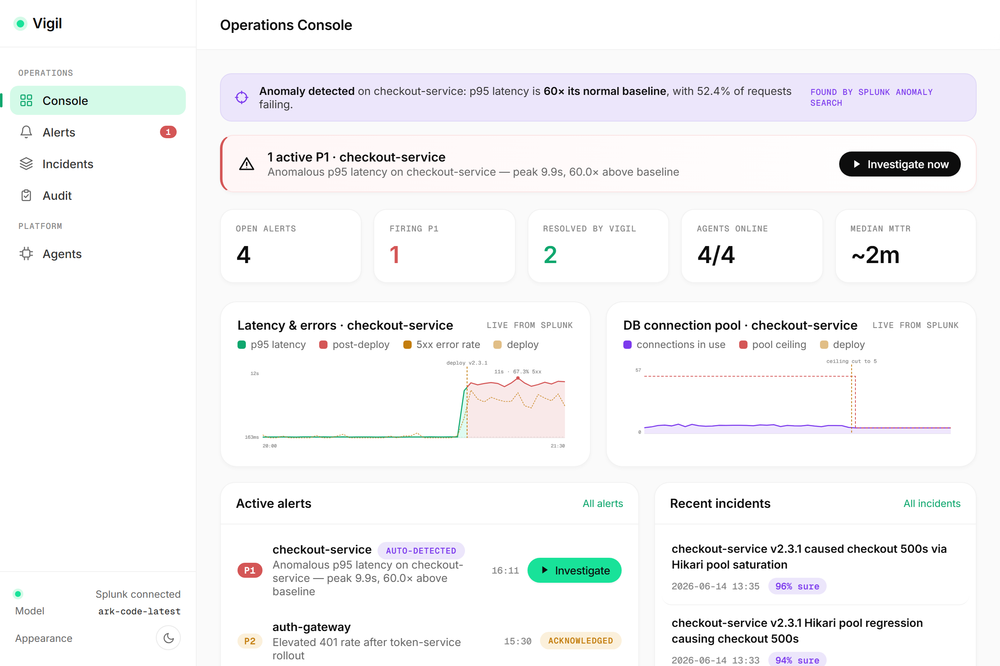
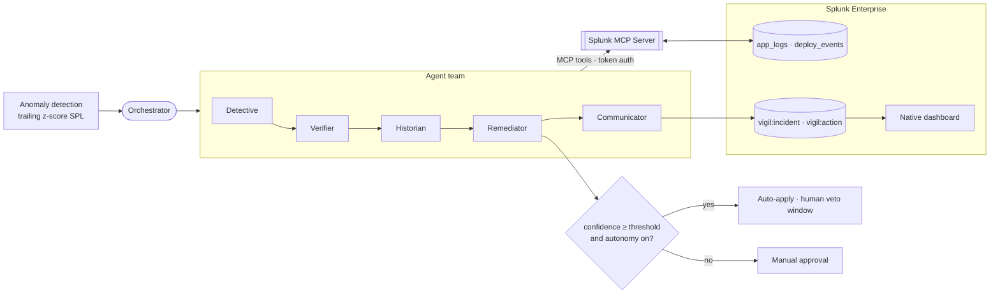
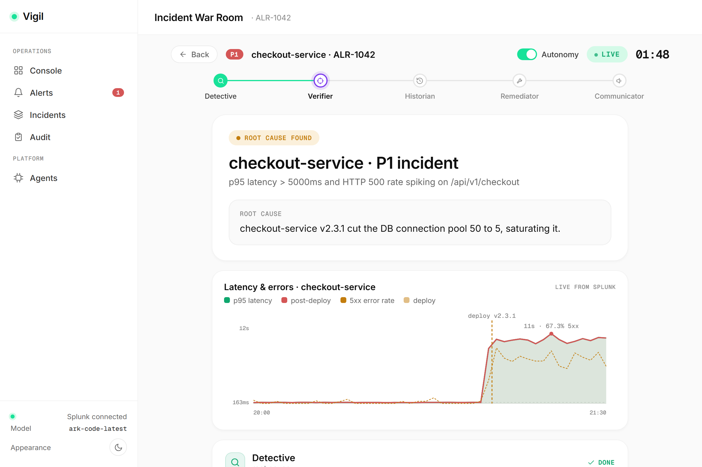
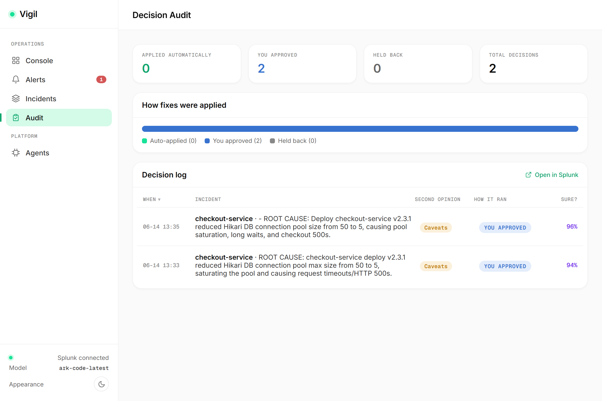
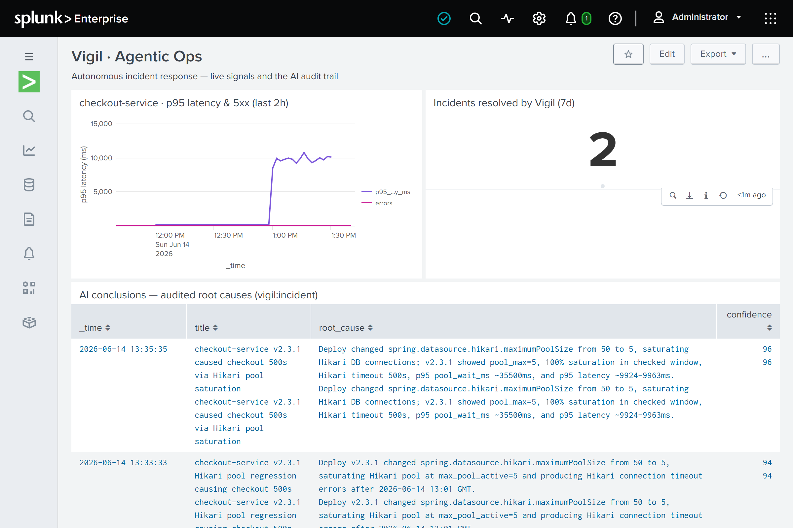

<div align="center">

# Vigil

### Autonomous on-call SRE, built on Splunk

Vigil is a team of AI agents that **detects, diagnoses, verifies, and fixes** production
incidents on its own — every conclusion grounded in live Splunk data through the Splunk MCP
Server, and every decision written back to Splunk for audit.

It takes a checkout-service outage from *page a human, wait ~45 minutes* to a **verified root
cause and an approved fix in ~2 minutes**.

`Splunk Agentic Ops Hackathon` · `Observability + Platform` · `MIT`

</div>



---

## Why Vigil

On-call is the same loop every time: an alert fires, a tired engineer pages in, opens Splunk,
and spends half an hour pivoting between logs, metrics, and deploy history to answer one
question — *what changed?* The data to resolve almost every incident already lives in Splunk.
The bottleneck is a human stitching it together under pressure.

Vigil closes that loop. It is not a chatbot that summarizes dashboards — it is a team that
investigates live data, argues with itself before acting, and earns the right to remediate.

| | Manual on-call | Vigil |
|---|---|---|
| **Detection** | Hand-tuned alert rules | Splunk statistical anomaly search, autonomous |
| **Diagnosis** | Engineer pivots across Splunk | Agents run ~30 live SPL searches via MCP |
| **Verification** | One pair of tired eyes | An adversarial agent tries to *disprove* the cause |
| **Remediation** | Manual, after escalation | Human-gated, or autonomous above a confidence bar |
| **Audit trail** | Tribal knowledge, chat scrollback | Written back to Splunk, searchable |
| **Time to resolution** | ~45 minutes | ~2 minutes |

---

## The agent team

A specialist team, each member with its own tools and its own reasoning loop.

| Agent | Responsibility | What it does |
|:--|:--|:--|
| **Detective** | Root cause | Runs multi-step SPL to find the inflection point and correlate it with change events. |
| **Verifier** | Second opinion | Independently re-checks the root cause, tries to refute it, and reports a *calibrated* confidence. |
| **Historian** | Change context | Surfaces the deploy behind the incident and a safe rollback target. |
| **Remediator** | The fix | Proposes a concrete, reviewable remediation with a confidence score. |
| **Communicator** | Record | Writes the incident summary and persists it back to Splunk. |

---

## How it works



Every agent reaches Splunk only through the **Splunk MCP Server** (Model Context Protocol,
token-based auth). No hardcoded data — the agents discover and call Splunk tools at runtime,
and every claim is backed by rows they actually retrieved.

---

## A run, end to end

**1 — Detection.** Vigil runs a statistical anomaly search over checkout-service latency and
raises the incident itself. No human wrote this alert.

**2 — Investigation.** The Detective streams its reasoning live: the SPL it runs, the rows it
gets back, the inflection it finds. The signals chart shows the smoking gun — p95 latency
spiking the moment a deploy lands.



**3 — Verification.** The Verifier acts as an adversarial skeptic, re-deriving the cause with
its own queries. Its calibrated confidence — not a self-report — decides what happens next.

**4 — Responsible autonomy.** Above the confidence threshold, Vigil applies the fix itself with
a human veto window; below it, approval is always manual. Either way the decision is logged.



**5 — Auditable in Splunk.** Conclusions and decisions are written back to Splunk and surfaced
on a native dashboard. You can search what Vigil decided, and why.



---

## The console

| View | What it gives you |
|:--|:--|
| **Operations Console** | KPIs, an anomaly-detection strip, live Splunk charts (latency/errors and DB pool saturation, each drillable straight into Splunk), and the active queue. |
| **Alert Inbox** | Triage queue; the top incident is auto-detected by the anomaly engine. |
| **Incident War Room** | The live investigation: a 5-agent stepper, per-agent conclusions with foldable SPL evidence, the autonomy/approval gate, and an MTTR comparison. |
| **Incident History** | Every resolved incident, audited in Splunk. |
| **Decision Audit** | Autonomous vs. human decisions, the Verifier's verdict, and confidence. |
| **Agents** | The team, their MCP tools, and live automation controls (autonomy, confidence threshold, adversarial verification). |

Light and dark themes, responsive, with a Splunk-native dashboard the agents write into.

---

## Quick start

**Option A — full stack with Docker**

```bash
cp .env.example .env          # set LLM_API_KEY (Volcengine Ark or any OpenAI-compatible)
docker compose up --build
```

Console at `http://localhost:8800`, Splunk at `http://localhost:8000` (`admin` / `Admin@123`).

**Option B — against an existing Splunk**

```bash
python -m venv .venv && .venv/Scripts/python -m pip install -r vigil/requirements.txt
cp .env.example .env          # set LLM_API_KEY and SPLUNK_* if not the defaults

python scripts/bootstrap.py   # indexes, HEC, token, demo data, native dashboard
python vigil/ui/server.py     # http://127.0.0.1:8800
```

The LLM backend is any OpenAI-compatible endpoint — Volcengine Ark (`ark-code-latest`) by
default, or OpenAI / Ollama / a Splunk hosted-model gateway by changing three `.env` values.

---

## Architecture

| Component | Path | Role |
|:--|:--|:--|
| Splunk MCP Server | `vigil/splunk_mcp/server.py` | Exposes Splunk over MCP: `splunk_search`, `splunk_list_indexes`, `splunk_server_info`, `splunk_write_event`. |
| Agent team | `vigil/agents/` | The five-agent orchestrator, the tool-use loop, the sync MCP bridge, and prompts. |
| Console | `vigil/ui/` | FastAPI + WebSocket backend and a dependency-light single-page app. |
| Splunk objects | `vigil/splunk_app/setup_splunk.py` | Pushes the native dashboard and saved searches. |
| Bootstrap | `scripts/bootstrap.py` | One-command, idempotent environment setup. |

**Stack:** Python · FastAPI · WebSockets · Model Context Protocol (FastMCP) · Volcengine Ark
(OpenAI-compatible, tool calling) · Splunk Enterprise 10.4 · SPL · REST API + HEC · vanilla
JS / SVG · Docker.

---

## The scenario

`checkout-service v2.3.1` ships with a PR titled *"Reduce idle DB connections to cut RDS cost"*
— which quietly drops HikariCP `maximumPoolSize` from **50 to 5**. The pool saturates,
connections time out, p95 latency jumps ~120ms → ~9.9s, and 5xx climbs past 58%. Vigil detects
the anomaly (~58× above baseline), finds the cause, adversarially verifies it, and rolls back —
all from raw logs and the deploy event, with zero hints.

---

## Notes

- Agents authenticate to Splunk with a JWT (`.splunk_token`), per the hackathon's token-based
  auth guidance. Secrets stay out of the repo via `.gitignore`.
- Demo data is time-relative; re-run `python vigil/ingest/seed_demo.py` (or
  `scripts/bootstrap.py`) after restarting the Splunk container.

## License

MIT — see [LICENSE](LICENSE).
