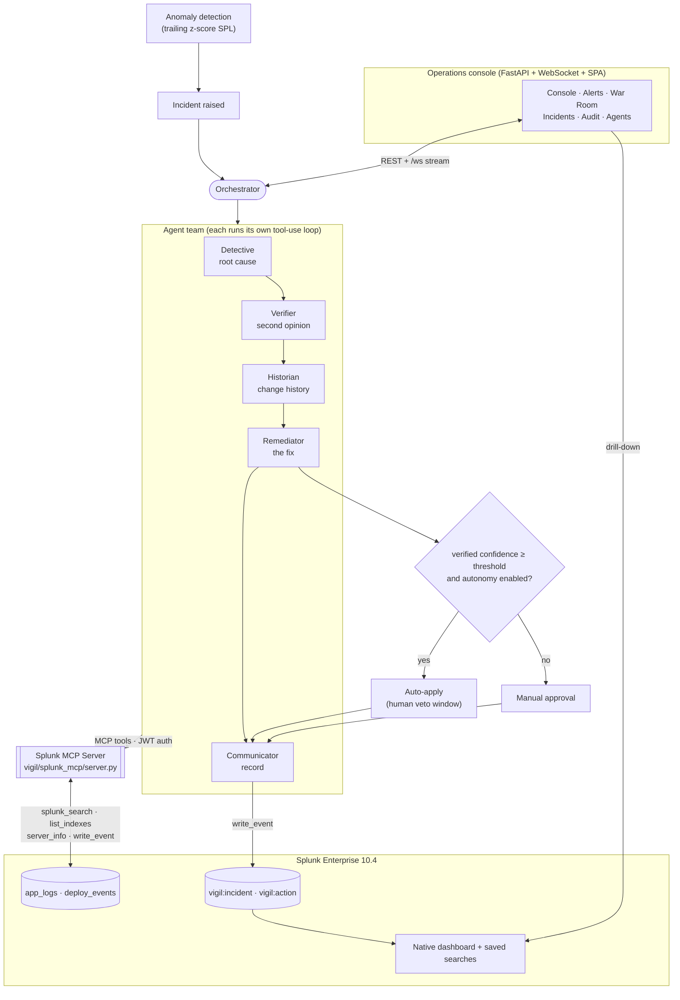
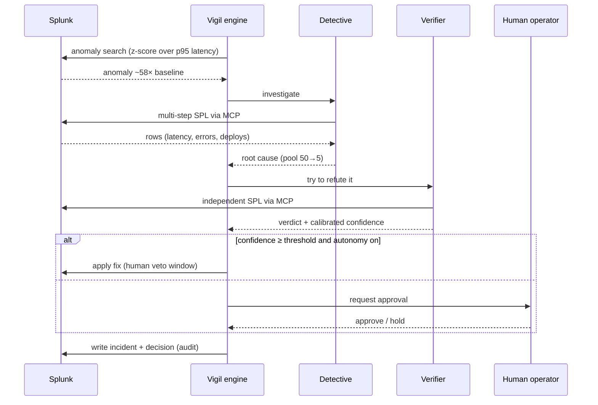

# Vigil — Architecture Diagram

Vigil is an autonomous on-call SRE built as a team of AI agents on top of Splunk. Every agent
reaches Splunk only through the **Splunk MCP Server** (Model Context Protocol, token-based
auth); every conclusion and decision is written back to Splunk for audit.

## System architecture

## End-to-end incident flow

## Components

| Component | Path | Role |
|:--|:--|:--|
| Splunk MCP Server | `vigil/splunk_mcp/server.py` | Exposes Splunk to agents over MCP: `splunk_search`, `splunk_list_indexes`, `splunk_server_info`, `splunk_write_event`. |
| Agent orchestrator | `vigil/agents/team.py` | Coordinates the five agents, the confidence gate, and the audit write-back. |
| Tool-use loop | `vigil/agents/llm.py` | OpenAI-compatible ReAct loop; streams every step to the UI. |
| MCP bridge | `vigil/agents/mcp_bridge.py` | Lets the synchronous agent loop discover and call MCP tools. |
| Console backend | `vigil/ui/server.py`, `vigil/ui/data.py` | FastAPI + WebSocket; anomaly detection, signals, incident/decision history. |
| Console frontend | `vigil/ui/static/index.html` | Single-page operations console. |
| Splunk objects | `vigil/splunk_app/setup_splunk.py` | Pushes the native dashboard and saved searches. |
| Bootstrap | `scripts/bootstrap.py` | One-command, idempotent environment setup. |

**Data plane:** Splunk Enterprise 10.4 — ingestion via HEC, reads via REST, audit write-back
via `receivers/simple`. Anomaly detection, signals, and history are all real SPL.

**LLM backend:** any OpenAI-compatible endpoint with tool calling (Volcengine Ark
`ark-code-latest` by default).
